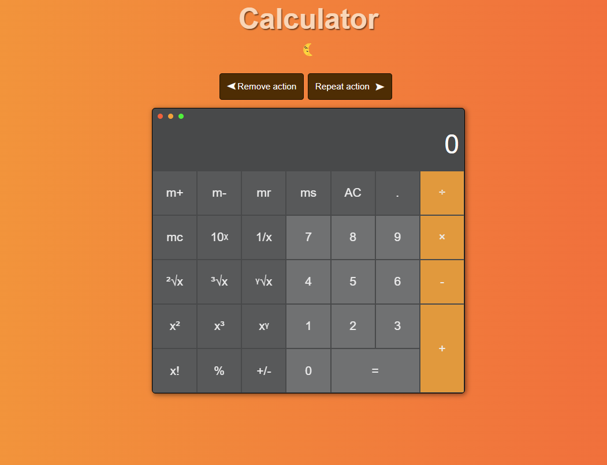
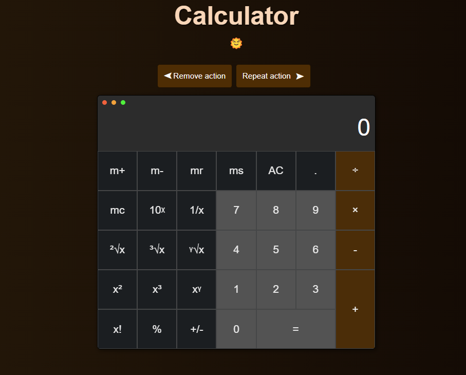

# Calculator

JS, Webpack, Eslint, Prettier, pre-commit hook, Jest

## Task

https://chat.google.com/u/0/api/get_attachment_url?url_type=DOWNLOAD_URL&attachment_token=AAigNUSWSzTRbkurGGF0h98ElfT6LrfluAZLUkXTiYBdwsZb1ALWH88m%2FyTt2Z%2FXcUSROj0RJUHmcpFwfPKGbmVZaLYW8OcA6rifWqhrB0aILufKk5jQcHdjDKCBNZVwgqM6ZoFUvopWnWCKbBVDhRIW9uH8389DeUpCFOT9dPnp0fuLtaeWd8yu0RE%2FgcMyOCUvO0811NI3YF0OvfvJQ1jACBwJaLFVscP3qxu6Ej6%2BkHUQ5Aiu6NB3sXRm2z1SvoRlELOuITDxlmIfXxeAxXNTajAUr97oJsmFhTFYxtQnSy%2BZ4uQSpAcx5hWh%2Fs%2F%2FIQhuddPB6R8zgNti8B19n7ENSd7Sj1ByOIUxlCrTWI9LMvZ7KsJ5BlfncZbJlTh00ygHH1WEpaz8vD2NMweAhm4ICJRQmXMitt8OHAl08%2FgKmsq0oLU8Ibl8DWHTD6faohgvdVK3NAhVRd80XcgilO5C4otFhbUYboGouZE4XkU%2FB2634oeS%2FOLr1WnyCULizF4g7V13n6UIpd9Ed9HEl32dCmuEmXmFYHarJO93n9YsjWSaJ2VCUcrYdMIv6j8QrXag1U2vbuQIUSwr%2B3h%2BrFSBRaU%2FwuS7ZDxvhWhD3w%3D%3D&auto=true

## How to run the app

Для того, чтобы запустить приложение, нужно:

1. Запустить Вашу IDE.
2. Открыть нужную папку с приложением CALCULATOR
3. В терминале написать команду npm i, для установки всех настроек и пакетов, прописанных в package.json
4. В терминале ввести команду npm run dev, для создания dev-версии приложения
5. Когда установка выполнится, запустить приложение, открыв файл index.html, находящийся в папке dist(которая была создана после предыдущего шага 4)
6. Либо сделать команду npm start в терминале для запуска приложения в браузере на локальном хосте

## Folders structure

Приложение состоит следующих файлов и папок:

1. .husky - данная папка содержит настройку команды, обеспечивающей pre-commit hook
2. .vscode
3. src
   Является основной папкой приложения, содержащей весь необходимый код,
   для корректного функционирования приложения. В ней содержатся:

- папка components. Содержит js файлы для работы основных компонентов приложения.
  Такие как калькулятор( обеспечивает работу калькулятора ),
  undoRedoFunc (описывает работу повторения и удаления действия, сохранение в истории дейтсвий),
  errorNotification (работа с всплывающими сообщениями об ошибке),
  styleSwitcher (работа с изменяющимися стилями при включении дневного/ночного режима)
- папка shared. Содержит всю дополнительную информацию для корректной работы,
  такую как:
  - используемые переменные,
  - сообщения об ошибке или какая-либо необходимая информация в строковом варианте,
    чтоб не успользовать подобную информацию в основном коде, так как в любой момент
    по запросу она может измениться,
  - функции для работы с LocalStorage,
  - папка с математическими формулами, которые были использованы в калькуляторе,
    вместе с файлом с тестами для этих формул.
- папка styles. Содержит файл стилей формата .scss.
- index.html и index.js - исходные файлы

4. Остальные .js и .json файлы, описывающие настройку сборщика webpack, тестов jest,
   настройщиков визуального отображения eslint и prettier
